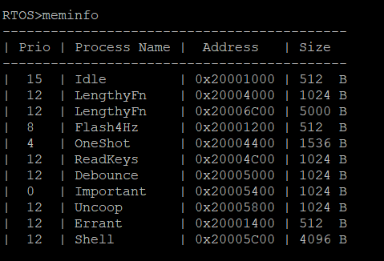
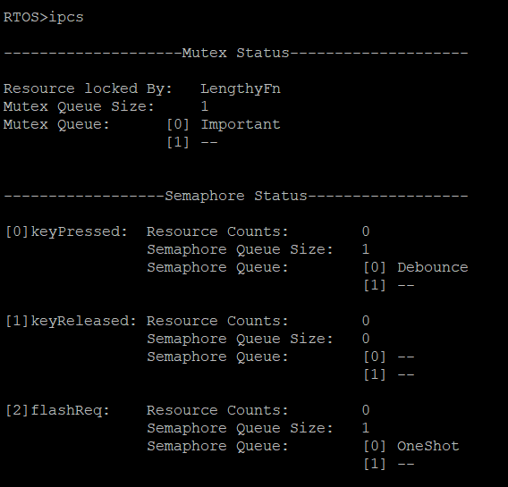
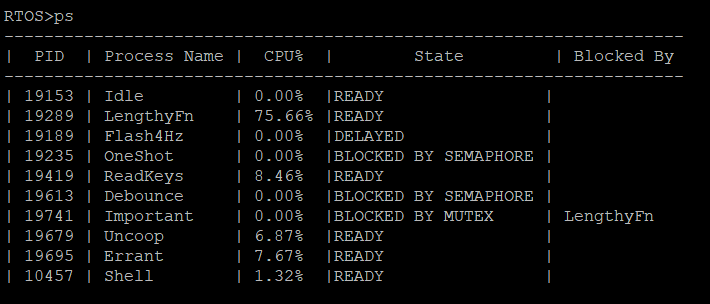

# RTOS
A custom RTOS framework for the TM4C MCU which includes custom implementation of malloc and free, priority-based scheduling, mutexes and semaphores and thread management

## Shell Interface

